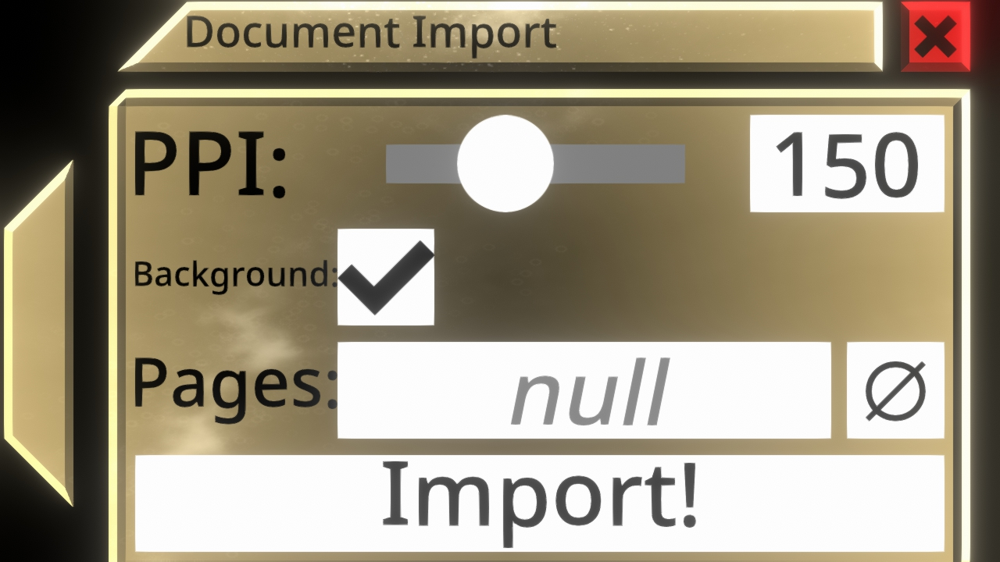
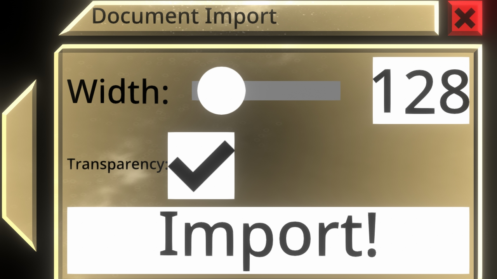
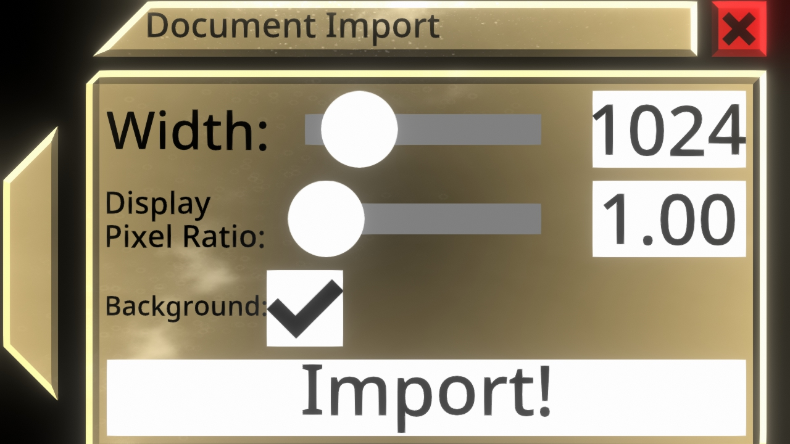

# NeosDocumentImport

A [NeosModLoader](https://github.com/zkxs/NeosModLoader) mod for [Neos VR](https://neos.com/) that adds custom file imports.

## Installation
1. Install [NeosModLoader](https://github.com/zkxs/NeosModLoader).
2. Download & unpack [NeosDocumentImport.zip](https://github.com/GithubUsername/RepoName/releases/latest/download/NeosDocumentImport.zip)
3. Copy the unpacked contents into your Neos install directory. (containing Neos.exe, NOT the launcher)
It should be at `C:\Program Files (x86)\Steam\steamapps\common\NeosVR\` for a default install.
4. Start the game. If you want to verify that the mod is working you can check your Neos logs.

To selectively install features refer to the following tables:

### Required
|File|Copy to|
|----|-------|
|nml_mods/NeosDocumentImport.dll|nml_mods/|

### PDF Importing
|File|Copy to|
|----|-------|
|pdfium.dll|next to Neos.exe|
|nml_libs/Docnet.Core.dll|nml_libs/|
|nml_mods/NeosDocumentImport_PDFImporter.dll|nml_mods/|

### SVG Importing
|File|Copy to|
|----|-------|
|nml_libs/ExCSS.dll|nml_libs/|
|nml_libs/Fizzler.dll|nml_libs/|
|nml_libs/Svg.dll|nml_libs/|
|nml_mods/NeosDocumentImport_SVGImporter.dll|nml_mods/|

### HTML Importing
|File|Copy to|
|----|-------|
|nml_mods/NeosDocumentImport_HTMLImporter.dll|nml_mods/|
|nml_libs/PuppeteerSharp.dll|nml_libs/|
Note: Puppeteer downloads and executes Chrome in the background to work.

## Usage
Just paste or drag&drop the PDF/SVG/HTML files into Neos.
Pasting URLs also works if it ends with with a proper file ending.
Importing from file objects or from within the Neos file browser are not yet supported.

An import dialog allows you to adjust the resolution and a few other settings.

### PDF Importing

|Setting|Description|Default|
|---|---|---|
|PPI|pixels per inch|150|
|Background|disable to render with transparent background|enabled|
|Pages|comma separated list of pages numbers, "1-3"="1,2,3"|empty (all pages)|

### SVG Importing

|Setting|Description|Default|
|---|---|---|
|Width|output width in px|128|
|Transparency|disable to render with white background|enabled|

### HTML Importing

|Setting|Description|Default|
|---|---|---|
|Width|window width in px|1024|
|Display Pixel Ratio|output pixel per window pixel|1.0|
|Background|disable to render with transparent background|enabled|

